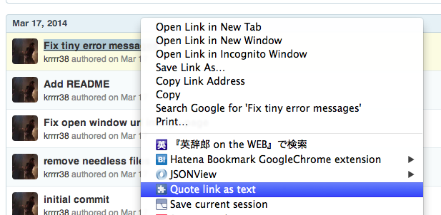

Quote Link As Text
==================

A chrome extension to quote link as a markdown text.



In the above case, it generate like below.

```markdown
[Fix tiny error messages](https://github.com/krrrr38/chrome-YouTube-Extract-Player/commit/a840647d037f9f5db59bbb9fb8f49710408f0cc3)
```

This extension is featured by [motemen/chrome-Quote-Image-As-Text](https://github.com/motemen/chrome-Quote-Image-As-Text)
